# 🌎 Projeto - Cidades ESG Inteligentes

API REST em **Java 21 + Spring Boot 4.1** que reúne indicadores **ambientais, sociais e de governança (ESG)** de cidades brasileiras, calcula um **score ESG de 0 a 100** e gera um **ranking**. O projeto aplica práticas completas de DevOps: **pipeline CI/CD no GitHub Actions**, **containerização com Docker**, **orquestração com Docker Compose** e **deploy automatizado em staging e produção** no Render.

| | |
|---|---|
| **Integrantes** | Julha Almeida Araujo (RM 562697) · Walter Seixas Nogueira (RM 565533) |
| **Repositório** | `https://github.com/[PREENCHER]/[PREENCHER]` |
| **Staging** | `https://[PREENCHER].onrender.com` |
| **Produção** | `https://[PREENCHER].onrender.com` |
| **Swagger** | `<url-do-ambiente>/swagger-ui.html` |

> ℹ️ Os ambientes usam o plano gratuito do Render: depois de 15 minutos sem acesso o serviço "dorme" e o primeiro acesso leva cerca de 1 minuto para responder.

---

## Sumário

1. [Sobre a aplicação](#-sobre-a-aplicação)
2. [Como executar localmente com Docker](#-como-executar-localmente-com-docker)
3. [Pipeline CI/CD](#-pipeline-cicd)
4. [Containerização](#-containerização)
5. [Configurar o deploy no Render](#-configurar-o-deploy-no-render-passo-a-passo)
6. [Prints do funcionamento](#-prints-do-funcionamento)
7. [Tecnologias utilizadas](#-tecnologias-utilizadas)
8. [Desafios encontrados e soluções](#-desafios-encontrados-e-soluções)
9. [Checklist de entrega](#-checklist-de-entrega)

---

## 🌆 Sobre a aplicação

Cada cidade recebe medições de 9 indicadores, 3 por pilar ESG. Cada valor é convertido em uma nota de 0 a 100 conforme a faixa de referência do indicador (em alguns, como emissões de CO₂ e mortalidade infantil, **menor é melhor**). A nota de cada pilar é a média dos seus indicadores, e o **score geral** é a média ponderada dos pilares: **Ambiental 40%**, **Social 30%** e **Governança 30%** (pesos configuráveis no `application.yml`). Sempre vale a medição mais recente de cada indicador.

| Classificação | Score |
|---|---|
| **A** - Excelente | 80 a 100 |
| **B** - Bom | 60 a 79,9 |
| **C** - Regular | 40 a 59,9 |
| **D** - Crítico | abaixo de 40 |

A migração `V2__dados_demonstracao.sql` cadastra 6 capitais com **valores ilustrativos** (criados para demonstração, não são estatísticas oficiais).

### Endpoints

| Método | Caminho | Descrição |
|---|---|---|
| `GET` | `/` | Página inicial: ambiente, versão, commit, saúde e ranking |
| `GET` | `/api/cidades?uf=PR` | Lista cidades (filtro opcional por UF) |
| `GET` | `/api/cidades/{id}` | Busca uma cidade |
| `POST` | `/api/cidades` | Cadastra uma cidade |
| `PUT` | `/api/cidades/{id}` | Atualiza uma cidade |
| `DELETE` | `/api/cidades/{id}` | Remove a cidade e suas medições |
| `GET` | `/api/indicadores/tipos` | Catálogo de indicadores e faixas de referência |
| `GET` | `/api/cidades/{id}/indicadores` | Medições da cidade |
| `POST` | `/api/cidades/{id}/indicadores` | Registra uma medição |
| `DELETE` | `/api/cidades/{id}/indicadores/{indicadorId}` | Remove uma medição |
| `GET` | `/api/cidades/{id}/score` | Score ESG da cidade, por pilar |
| `GET` | `/api/ranking` | Ranking das cidades |
| `GET` | `/api/info` | Ambiente, versão e commit em execução (usado pelo pipeline) |
| `GET` | `/actuator/health` | Health check (com `/liveness` e `/readiness`) |
| `GET` | `/swagger-ui.html` | Documentação interativa (OpenAPI) |

Erros seguem o padrão **Problem Details (RFC 9457)**: `400` dados inválidos, `404` não encontrado, `409` duplicado, `422` regra de negócio.

<details>
<summary>Exemplo de uso com curl</summary>

```bash
# cadastrar uma cidade
curl -X POST http://localhost:8080/api/cidades \
  -H "Content-Type: application/json" \
  -d '{"nome": "Porto Alegre", "uf": "RS", "populacao": 1332000}'

# registrar uma medição (use o id retornado acima)
curl -X POST http://localhost:8080/api/cidades/7/indicadores \
  -H "Content-Type: application/json" \
  -d '{"tipo": "ENERGIA_RENOVAVEL", "valor": 82.5, "dataReferencia": "2025-12-31", "fonte": "Prefeitura"}'

# score e ranking
curl http://localhost:8080/api/cidades/7/score
curl http://localhost:8080/api/ranking
```
</details>

---

## 🚀 Como executar localmente com Docker

**Pré-requisito:** Docker Desktop (Windows/macOS) ou Docker Engine com o plugin Compose v2 (Linux). Não é preciso ter Java nem PostgreSQL instalados.

```bash
# 1. Entre na pasta do projeto
cd cidades-esg-inteligentes

# 2. Crie o arquivo de variáveis a partir do modelo (e troque a senha do banco)
cp .env.example .env            # Windows (PowerShell): copy .env.example .env

# 3. Construa a imagem e suba aplicação + PostgreSQL
docker compose up -d --build

# 4. Acompanhe até os dois serviços ficarem "healthy" (leva cerca de 1 minuto)
docker compose ps
```

Depois acesse:

| O quê | Endereço |
|---|---|
| Página inicial | http://localhost:8080 |
| Swagger (testar a API) | http://localhost:8080/swagger-ui.html |
| Health check | http://localhost:8080/actuator/health |
| Versão em execução | http://localhost:8080/api/info |

Comandos úteis:

```bash
docker compose logs -f app                 # logs da aplicação
docker compose --profile tools up -d       # sobe também o Adminer em http://localhost:8090
                                           #   (Sistema: PostgreSQL, Servidor: db, Usuário/Senha/Base: os do .env)
bash scripts/smoke-test.sh http://localhost:8080 local --escrita   # testa a API de ponta a ponta
docker compose down                        # para tudo (os dados continuam no volume)
docker compose down -v                     # para tudo e apaga os dados
```

**Simular staging e produção na mesma máquina.** O mesmo `docker-compose.yml` sobe ambientes isolados (containers, rede e volumes próprios), mudando só as variáveis:

```bash
docker compose -p cidades-esg-staging    --env-file .env --env-file envs/staging.env    up -d --build   # http://localhost:8081
docker compose -p cidades-esg-production --env-file .env --env-file envs/production.env up -d --build   # http://localhost:8082
```

**Sem Docker (desenvolvimento):** `./mvnw test` roda os testes unitários. `./mvnw verify` roda também os testes de integração, que precisam de um PostgreSQL em `localhost:5432` (ou use `./mvnw verify -DskipITs`).

---

## 🔄 Pipeline CI/CD

**Ferramenta:** GitHub Actions. Arquivo: [`.github/workflows/ci-cd.yml`](.github/workflows/ci-cd.yml).

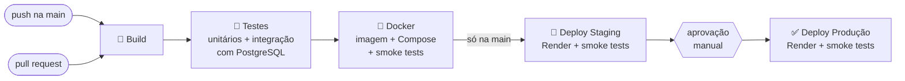

| Etapa (job) | O que faz | Por que importa |
|---|---|---|
| **🔨 Build** | Configura o Java 21 (cache do Maven), compila e empacota o JAR com o Maven Wrapper e guarda o JAR como artefato da execução. | Garante que todo commit compila, sempre com a mesma versão do Maven. |
| **🧪 Testes** | Roda `mvn verify`: **40 testes unitários** (regras do score, serviços com Mockito, API com MockMvc) e **4 testes de integração** que sobem a aplicação inteira contra um **PostgreSQL 17 real** (service container), aplicando as migrações do Flyway. Publica o relatório de testes no commit e o resumo de cobertura (JaCoCo). | Qualquer teste falhando interrompe o pipeline antes de qualquer deploy. |
| **🐳 Docker** | Constrói a imagem pelo `Dockerfile` (com cache), sobe **aplicação + PostgreSQL com o `docker-compose.yml`**, espera os health checks, roda os **smoke tests** e derruba o ambiente. Na `main`, publica a imagem no **GitHub Container Registry** com as tags `sha-<commit>` e `latest`. | Valida a imagem e a orquestração de verdade, do jeito que vão rodar em produção. |
| **🚀 Deploy Staging** | Chama o **deploy hook** do serviço de staging no Render passando o commit (`ref=<sha>`), aguarda `/api/info` responder com esse commit e roda os smoke tests completos (leitura e escrita). | Cada versão é validada em um ambiente igual ao de produção. |
| **✅ Deploy Produção** | Só começa se staging passou. Com *required reviewers* no ambiente `production`, **espera aprovação manual**. Faz o mesmo deploy com o **mesmo commit** e roda smoke tests somente leitura. | Produção recebe exatamente o que foi validado em staging. |

**Como o pipeline funciona:**

- **Gatilhos:** em *pull request* para a `main` rodam Build, Testes e Docker (validação sem deploy). Em *push* na `main` ou execução manual (*Run workflow*) roda o fluxo completo.
- **Verificação do deploy:** o script [`scripts/render-deploy.sh`](scripts/render-deploy.sh) só considera o deploy concluído quando a aplicação responde em `/api/info` com o commit do pipeline. Enquanto o Render constrói a nova versão, a anterior continua no ar (deploy sem indisponibilidade, graças ao health check `/actuator/health/readiness`).
- **Smoke tests:** [`scripts/smoke-test.sh`](scripts/smoke-test.sh) confere health check, readiness (com banco), ambiente correto, ranking, catálogo, OpenAPI e página inicial. Em CI e staging também cadastra, pontua e remove uma cidade de teste.
- **Segredos:** os deploy hooks ficam em **GitHub Secrets** e as URLs em **GitHub Variables**; nada sensível fica no código. A senha do banco no Render é injetada pela própria plataforma (`render.yaml`).
- **Ambientes do GitHub:** os jobs de deploy usam os *environments* `staging` e `production`, que guardam o histórico de deploys e mostram o link do ambiente no grafo da execução.
- **Resumos:** cada execução publica no *Summary* o resultado dos testes, a cobertura, os smoke tests e o commit publicado em cada ambiente.

---

## 🐳 Containerização

### Dockerfile

<!-- DOCKERFILE:INICIO -->
```dockerfile
# =============================================================================
# Cidades ESG Inteligentes - Dockerfile multi-stage
#
#   Etapa 1 (build):   compila com Maven + JDK 21 e separa o JAR em camadas
#   Etapa 2 (runtime): imagem final enxuta, só com o JRE 21 e usuário sem root
#
# Build:  docker build -t cidades-esg-inteligentes .
# Run:    docker compose up -d   (veja o docker-compose.yml e o README)
# =============================================================================

# ---------- Etapa 1: build ----------
FROM eclipse-temurin:21-jdk-alpine AS build
WORKDIR /workspace

# Primeiro só o Maven Wrapper e o pom.xml: a camada com as dependências fica em
# cache e só é refeita quando o pom.xml muda (builds seguintes ficam bem mais rápidos).
COPY .mvn/ .mvn/
COPY mvnw pom.xml ./
RUN sed -i 's/\r$//' mvnw && chmod +x mvnw \
    && ./mvnw -B -q dependency:go-offline

# Depois o código-fonte. Os testes já rodaram na etapa "Testes" do pipeline,
# por isso aqui o pacote é gerado sem executá-los.
COPY src/ src/
RUN ./mvnw -B -q package -DskipTests \
    && cp target/cidades-esg.jar application.jar \
    && java -Djarmode=tools -jar application.jar extract --layers --destination extracted

# ---------- Etapa 2: runtime ----------
FROM eclipse-temurin:21-jre-alpine

LABEL org.opencontainers.image.title="cidades-esg-inteligentes" \
      org.opencontainers.image.description="API de indicadores ESG para cidades inteligentes (Spring Boot 4, Java 21)"

# Usuário sem privilégios: a aplicação nunca roda como root
RUN addgroup -S app && adduser -S -G app -h /app app \
    && mkdir -p /app/logs && chown -R app:app /app
WORKDIR /app

# Camadas da aplicação, da que muda menos (dependências) para a que muda mais (código)
COPY --from=build --chown=app:app /workspace/extracted/dependencies/ ./
COPY --from=build --chown=app:app /workspace/extracted/spring-boot-loader/ ./
COPY --from=build --chown=app:app /workspace/extracted/snapshot-dependencies/ ./
COPY --from=build --chown=app:app /workspace/extracted/application/ ./

# Commit gravado na imagem (exibido em /api/info). No Render, RENDER_GIT_COMMIT tem prioridade.
ARG GIT_COMMIT=local
# JVM ajustada para containers pequenos (o plano gratuito do Render tem 512 MB e 0,1 CPU):
# heap limitada a 60% da memória do container, GC serial e só o compilador C1 (inicialização mais rápida).
ENV APP_COMMIT=${GIT_COMMIT} \
    PORT=8080 \
    JAVA_OPTS="-XX:MaxRAMPercentage=60 -XX:+UseSerialGC -XX:TieredStopAtLevel=1 -Xss512k -XX:+ExitOnOutOfMemoryError"

USER app
EXPOSE 8080

# Liveness: o processo responde (a conexão com o banco é verificada no readiness)
HEALTHCHECK --interval=30s --timeout=5s --start-period=90s --retries=3 \
    CMD wget -q -O /dev/null "http://127.0.0.1:${PORT}/actuator/health/liveness" || exit 1

# "exec" faz o Java receber o SIGTERM direto, permitindo o desligamento gracioso
ENTRYPOINT ["sh", "-c", "exec java $JAVA_OPTS -jar application.jar"]
```
<!-- DOCKERFILE:FIM -->

**Estratégias adotadas:**

| Estratégia | Como | Benefício |
|---|---|---|
| **Multi-stage build** | Etapa `build` com JDK 21 + Maven; etapa final só com o **JRE 21 Alpine** | Imagem final sem compilador, Maven nem código-fonte: menor e com menos superfície de ataque |
| **Cache de dependências** | `pom.xml` e Maven Wrapper copiados antes do código; `dependency:go-offline` em camada própria | Alterar só o código não baixa as dependências de novo |
| **Camadas do Spring Boot** | `java -Djarmode=tools ... extract --layers` separa dependências, loader e aplicação | Um novo deploy envia só a camada do código (poucos KB) |
| **Usuário sem root** | Usuário `app` criado na imagem (`USER app`) | Limita o estrago caso a aplicação seja comprometida |
| **Health check** | `HEALTHCHECK` em `/actuator/health/liveness` | O Docker sabe quando o processo travou |
| **JVM para containers pequenos** | `-XX:MaxRAMPercentage=60`, GC serial, compilador C1 | Cabe nos 512 MB / 0,1 CPU do plano gratuito do Render e inicia mais rápido |
| **Desligamento gracioso** | `exec java` + `server.shutdown=graceful` | Requisições em andamento terminam antes do container parar |
| **Configuração por ambiente** | Tudo via variáveis (`APP_ENV`, `DB_*`, `SPRING_PROFILES_ACTIVE`...) | A **mesma imagem** roda em local, CI, staging e produção |
| **`.dockerignore`** | Exclui `.git`, `target`, `.env`, docs | Build mais rápido e nenhum segredo dentro da imagem |

### Docker Compose

Arquivo: [`docker-compose.yml`](docker-compose.yml)

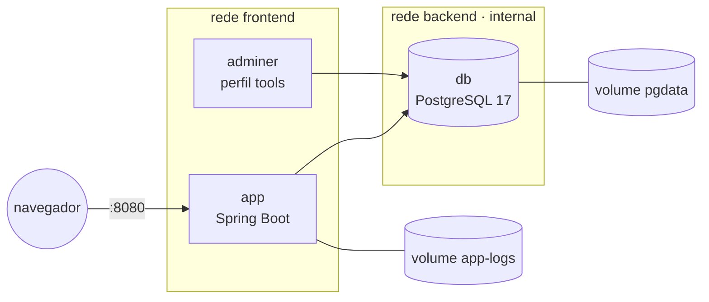

| Recurso | Uso no projeto |
|---|---|
| **Serviços** | `app` (API), `db` (PostgreSQL 17) e `adminer` (opcional, perfil `tools`) |
| **Volumes** | `pgdata` (dados do banco persistem entre reinícios) e `app-logs` (arquivo de log da aplicação) |
| **Redes** | `frontend` (portas publicadas) e `backend` **interna**: o banco não tem porta exposta nem acesso à internet |
| **Variáveis de ambiente** | Lidas do `.env` (modelo em [`.env.example`](.env.example)); a senha é obrigatória (`${DB_PASSWORD:?}`) |
| **Health checks e ordem de subida** | `db` usa `pg_isready`; `app` só sobe com o banco saudável (`depends_on: service_healthy`) e fica pronto quando `/actuator/health/readiness` (que inclui o banco) responde |
| **Reinício automático** | `restart: unless-stopped` |

### Infraestrutura como código (Render)

O arquivo [`render.yaml`](render.yaml) (Blueprint) cria os dois ambientes de forma reproduzível: o banco `cidades-esg-db` (PostgreSQL 17, plano free, sem acesso externo) e os serviços Docker `cidades-esg-staging` e `cidades-esg-production`, com perfis Spring, health check e variáveis próprios. O deploy automático no push fica **desligado**: quem publica é o pipeline, depois de todas as validações.

---

## 🔧 Configurar o deploy no Render (passo a passo)

Feito uma única vez. Depois disso, cada push na `main` publica em staging e, após aprovação, em produção.

1. **Publique o código em um repositório público no GitHub** (branch `main`):
   ```bash
   git init
   git add .
   git commit -m "Projeto Cidades ESG Inteligentes"
   git branch -M main
   git remote add origin https://github.com/<usuario>/<repositorio>.git
   git push -u origin main
   ```
   O pipeline já roda Build, Testes e Docker. Os jobs de deploy vão falhar com *"Deploy hook não configurado"* até o passo 5; isso é esperado.
2. **Crie uma conta no [Render](https://render.com)** entrando com o GitHub.
3. **Crie os ambientes pelo Blueprint:** *New > Blueprint* > selecione o repositório > *Apply*. O Render lê o `render.yaml` e cria o banco e os dois serviços (o primeiro build leva alguns minutos).
4. **Copie os dados de cada serviço** (`cidades-esg-staging` e `cidades-esg-production`): a URL pública (ex.: `https://cidades-esg-staging.onrender.com`) e o **Deploy Hook** (*Settings > Deploy Hook*).
5. **Cadastre no GitHub** (*Settings > Secrets and variables > Actions*):

   | Tipo | Nome | Valor |
   |---|---|---|
   | Secret | `RENDER_DEPLOY_HOOK_STAGING` | deploy hook do serviço de staging |
   | Secret | `RENDER_DEPLOY_HOOK_PRODUCTION` | deploy hook do serviço de produção |
   | Variable | `STAGING_URL` | URL pública de staging |
   | Variable | `PRODUCTION_URL` | URL pública de produção |

6. **Exija aprovação para produção (recomendado):** *Settings > Environments > production > Required reviewers*, adicione um integrante e salve. (Os ambientes `staging` e `production` são criados pelo próprio pipeline; se não aparecerem, crie com *New environment*.)
7. **Rode o pipeline:** *Actions > CI/CD > Run workflow* (ou faça um novo push). Quando o job de produção pedir, clique em *Review deployments > Approve and deploy*.

> **Limites do plano gratuito do Render:** só 1 banco PostgreSQL gratuito por conta (por isso staging e produção usam *schemas* separados no mesmo banco), e o banco gratuito expira 30 dias após a criação. Se expirar, crie de novo pelo Blueprint e rode o pipeline.

---

## 📸 Prints do funcionamento

> Substitua cada imagem de `docs/prints/` por um print real **com o mesmo nome de arquivo**; o README e a documentação passam a mostrar os prints automaticamente.

### Pipeline (build, testes e deploy)

| Pipeline completo | Build |
|---|---|
| 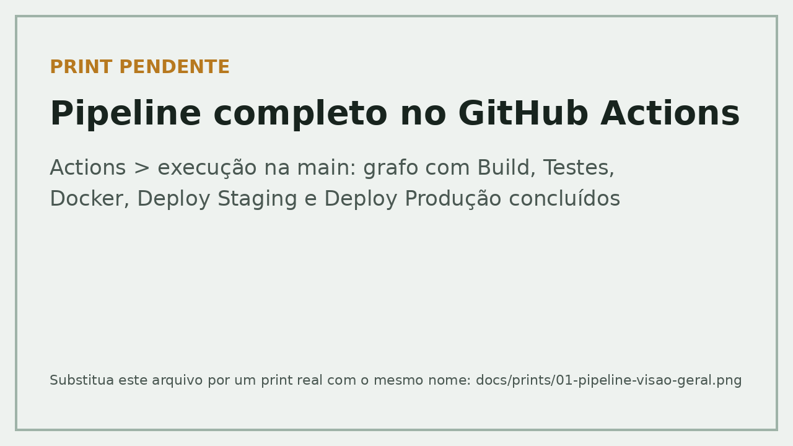 | 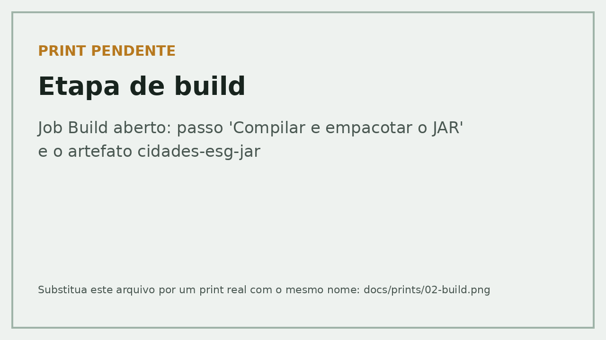 |
| **Testes automatizados** | **Docker + Compose no CI** |
| 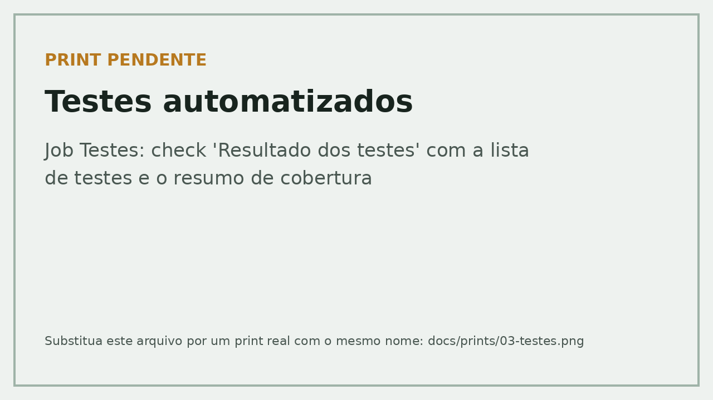 | 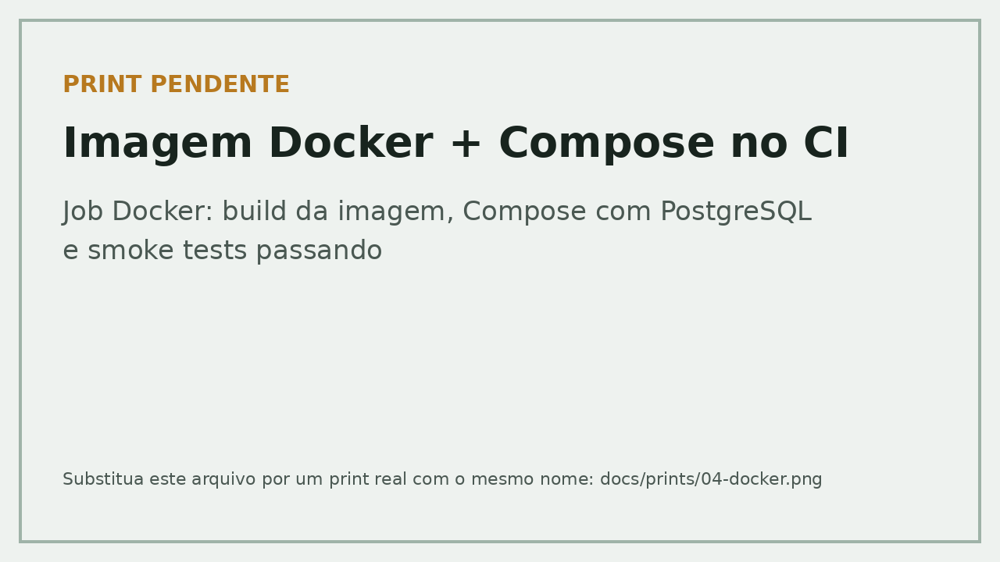 |
| **Deploy em staging** | **Aprovação para produção** |
| 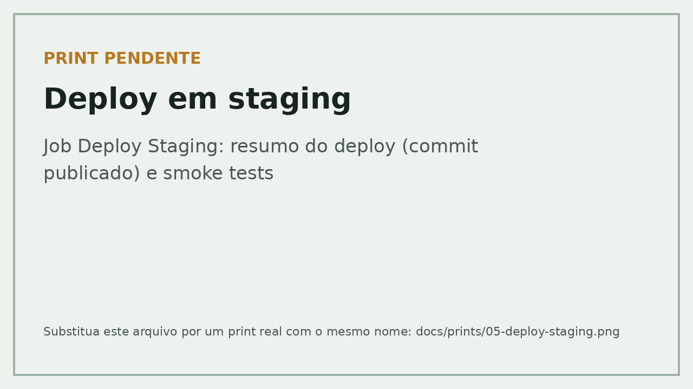 | 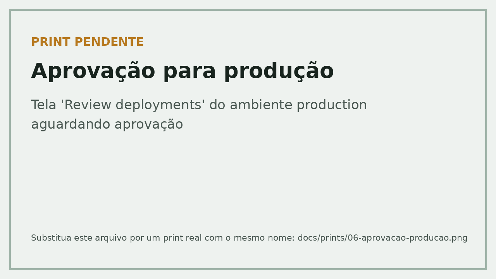 |
| **Deploy em produção** | **Imagem publicada no GHCR** |
| 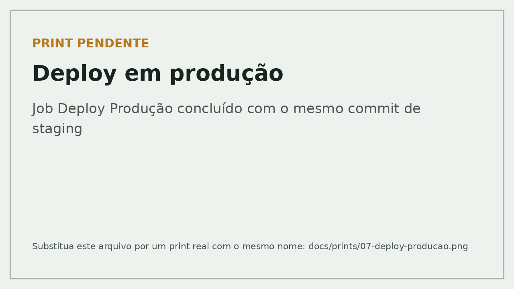 | 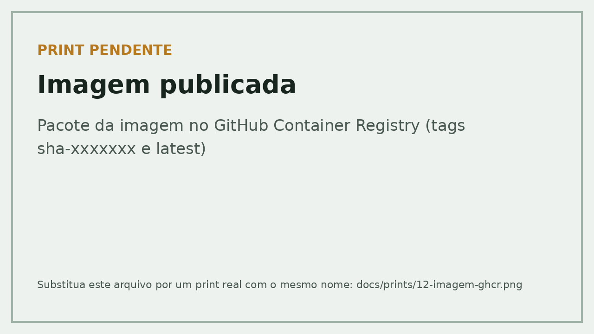 |

### Ambientes funcionando

| Staging | Produção |
|---|---|
| 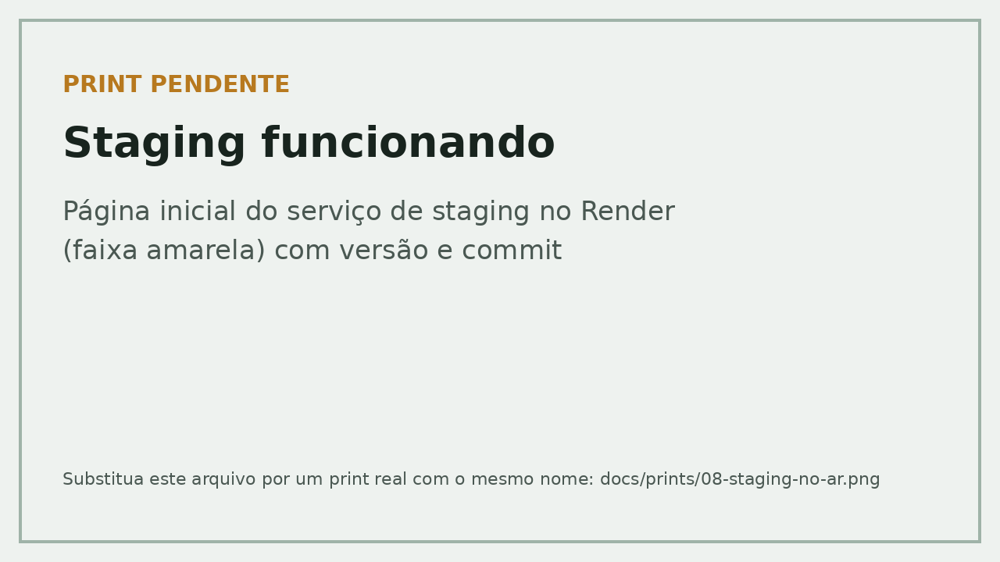 | 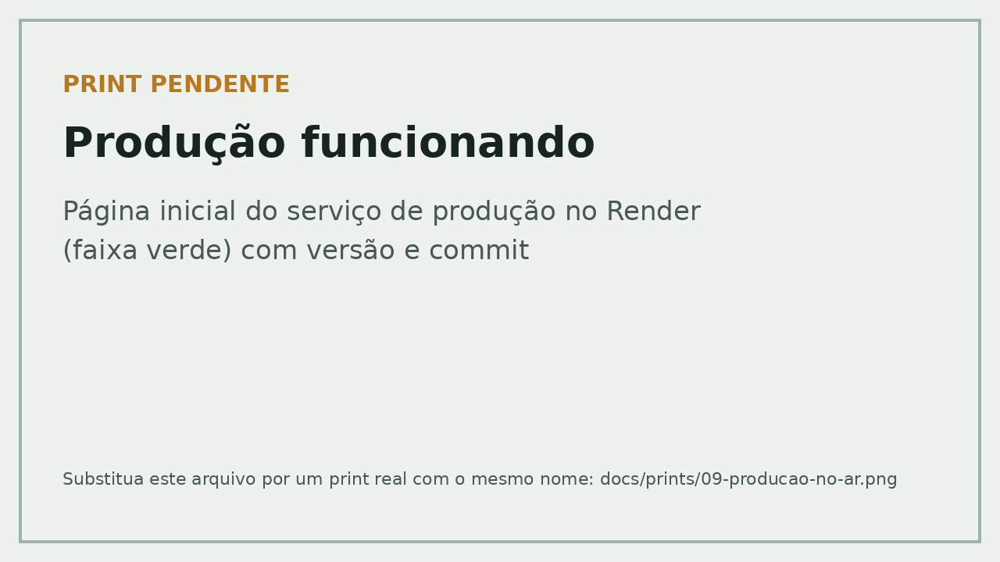 |
| **Serviços no Render** | **Execução local com Docker Compose** |
| 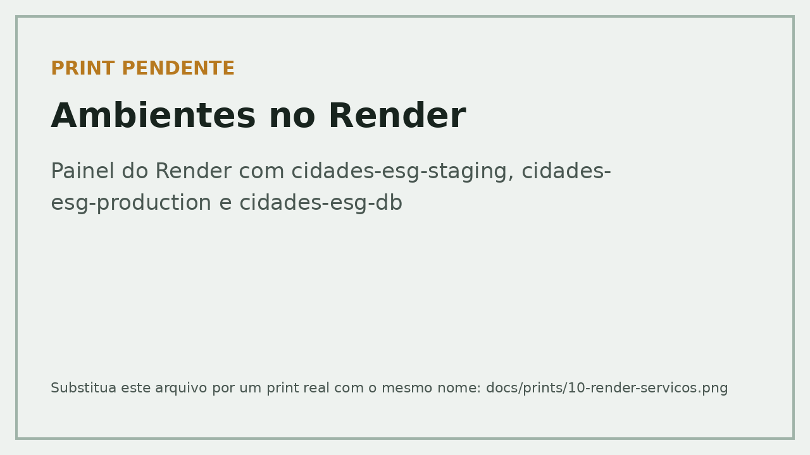 | 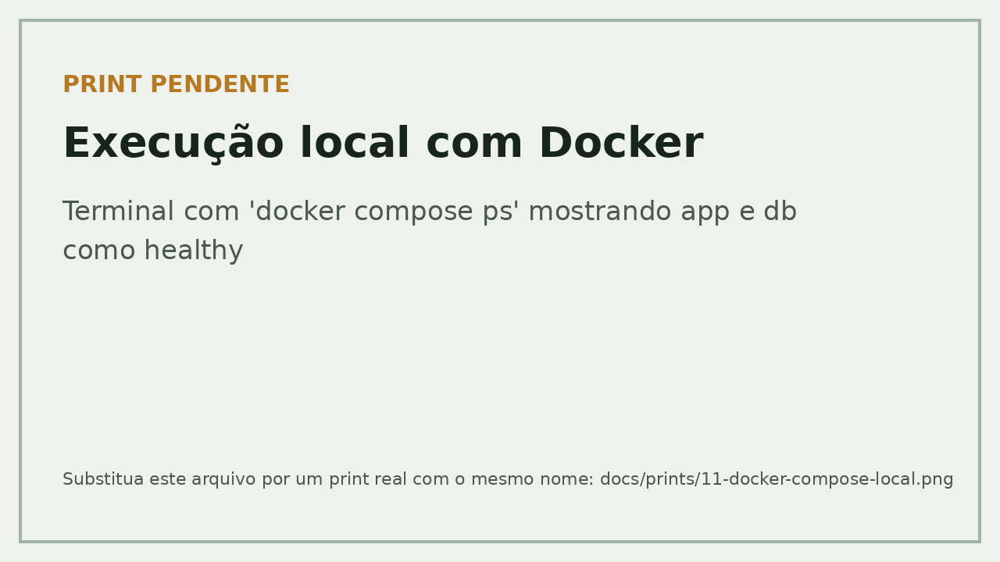 |

---

## 🧰 Tecnologias utilizadas

| Categoria | Tecnologias |
|---|---|
| **Linguagem e framework** | Java 21, Spring Boot 4.1 (Web MVC, Data JPA, Validation, Actuator), Hibernate 7 |
| **Banco de dados** | PostgreSQL 17, Flyway 12 (migrações versionadas) |
| **Documentação da API** | springdoc-openapi 3 (OpenAPI 3.1 + Swagger UI) |
| **Testes** | JUnit 6, Mockito 5, AssertJ, Spring MockMvc, JaCoCo (cobertura) |
| **Build** | Maven 3.9 (Maven Wrapper) |
| **Containers** | Docker (multi-stage, Eclipse Temurin 21 Alpine), Docker Compose, Adminer |
| **CI/CD** | GitHub Actions, GitHub Environments, Secrets e Variables, GitHub Container Registry |
| **Nuvem** | Render (web services Docker + PostgreSQL gerenciado, Blueprint `render.yaml`) |
| **Scripts** | Bash + curl (deploy e smoke tests) |

### Estrutura do projeto

```
cidades-esg-inteligentes/
├── .github/workflows/ci-cd.yml     # pipeline CI/CD
├── Dockerfile                      # imagem da aplicação (multi-stage)
├── docker-compose.yml              # app + PostgreSQL + Adminer, volumes e redes
├── render.yaml                     # infraestrutura de staging e produção (Render Blueprint)
├── .env.example                    # modelo de variáveis de ambiente
├── envs/                           # variáveis para simular staging e produção localmente
├── scripts/                        # render-deploy.sh e smoke-test.sh
├── docs/                           # documentação técnica (PPT) e prints
├── src/main/java/br/com/fiap/cidadesesg/
│   ├── config/                     # propriedades, OpenAPI, log de inicialização
│   ├── domain/                     # entidades e catálogo de indicadores
│   ├── score/                      # cálculo do score ESG (Java puro)
│   ├── repository/                 # Spring Data JPA
│   ├── service/                    # regras de negócio
│   └── web/                        # controllers, DTOs e tratamento de erros
├── src/main/resources/
│   ├── application*.yml            # configuração base + perfis staging/production
│   ├── db/migration/               # migrações Flyway (V1 estrutura, V2 dados de demonstração)
│   └── static/index.html           # página inicial
├── src/test/java/...               # testes unitários (*Test) e de integração (*IT)
├── pom.xml
└── mvnw, mvnw.cmd, .mvn/           # Maven Wrapper
```

---

## 🧩 Desafios encontrados e soluções

| Desafio | Solução |
|---|---|
| O plano gratuito do Render permite **apenas 1 PostgreSQL** por conta, mas precisávamos de staging e produção isolados. | Cada ambiente usa um **schema próprio** (`DB_SCHEMA`) no mesmo banco. O Flyway cria e migra o schema de cada ambiente separadamente. |
| Garantir que **produção recebe exatamente o que foi testado** em staging. | O pipeline envia o mesmo commit (`ref=<sha>`) para os dois deploy hooks e só segue quando `/api/info` responde com esse commit. |
| Saber se o deploy **terminou de verdade** (o Render responde ao hook na hora, mas o build leva minutos). | Script de deploy que consulta `/api/info` até o commit novo aparecer, com tempo limite e mensagem de erro clara. |
| Spring Boot em **512 MB de RAM e 0,1 CPU** (plano gratuito). | JVM ajustada para container (heap a 60%, GC serial, compilador C1), pool de conexões pequeno e imagem JRE Alpine. |
| Testar com o **mesmo banco de produção** (PostgreSQL), não com banco em memória. | Testes de integração com PostgreSQL real no GitHub Actions (*service container*) e smoke tests com Docker Compose no CI. |
| **Segredos** fora do código. | GitHub Secrets/Variables no pipeline, `.env` local fora do Git (com `.env.example` de modelo) e credenciais do banco injetadas pelo Render. |
| Scripts quebrando por **fim de linha do Windows (CRLF)**. | `.gitattributes` força LF nos scripts e o Dockerfile normaliza o `mvnw` antes de usá-lo. |
| Swagger e links gerados com **http** atrás do proxy HTTPS do Render. | `server.forward-headers-strategy: framework` faz a aplicação respeitar os cabeçalhos `X-Forwarded-*`. |

---

## ✅ Checklist de entrega

| Item | OK |
|---|:---:|
| Projeto compactado em .ZIP com estrutura organizada | ✅ |
| Dockerfile funcional | ✅ |
| docker-compose.yml ou arquivos Kubernetes | ✅ |
| Pipeline com etapas de build, teste e deploy | ✅ |
| README.md com instruções e prints | ✅ |
| Documentação técnica com evidências (PDF ou PPT) | ✅ |
| Deploy realizado nos ambientes staging e produção | ✅ |
